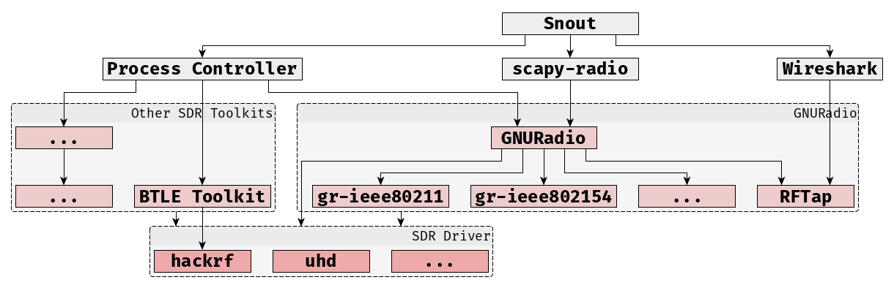

# Snout

##  Abstract

Network mapping tools designed for IP-based networks generally do not provide access to non-IP based wireless protocols used by Internet of Things (IoT) devices, such as Zigbee and Bluetooth LE. We present Snout, a versatile and extensible software defined radio-based tool for IoT network mapping and penetration testing. Snout is geared towards the various IoT protocols that are not accessible with traditional network enumeration tools, such as Nmap. The tool allows for device enumeration, vulnerability assessment, as well as more offensive techniques such as packet replay and spoofing, which we demonstrate for the Zigbee protocol. Snout is built on an open-source stack, and is designed for extensibility towards other IoT protocols and capabilities.

Our goal is for Snout to become an *'Nmap for IoT devices' across various wireless protocols*.

## Important Notes

This code is in active development and should be considered 'alpha' (i.e., API changes may occur without warning, and functionality is experimental at this point). It is provided as is, with no warranty of any kind. All licenses of underlying components apply individually.

Before using Snout, make yourself familiar with the legal situation regarding sniffing and transmitting in the ISM bands that apply to your location.

## Architecture

Snout is in active development and will grow beyond what is shown in the picture below. This is a high-level breakdown of how Snout interacts with various tools and libraries to facilitate access to SDR-based wireless protocol interaction.

## Installation

Snout assumes a working GNU Radio installation as a prerequisite.

It can be installed by running

    sudo make install

from the root directory.

## Usage

    Usage: snout [OPTIONS] [zwave|zigbee|wifi|btle] COMMAND [ARGS]...

      Welcome to Snout!

      This application is designed to provide a powerful and accessible scanning tool for IoT devices with the
      use of Software Defined Radios.

    Options:
      -auto, --automatic TEXT  List of commands to automatically enter. The program generates this
      -i, --interactive        Interactive guide mode.
      -d, --display            Display the results interactively in the terminal after the scan
      -h, --hardware TEXT      Choose a specific hardware to use. This is useful if several SDRs are plugged in
      -f, --filename TEXT      Filename to dump the ouptut to. If not given, a timestamped file in
                              /home/jkbecker/.local/share/Snout/outputs is created
      -w, --wireshark          Open up the test in wireshark
      --help                   Show this message and exit.

    Commands:
      scan      Perform a scan operation
      transmit  Perform a transmission operation

## Authors

* [Johannes K Becker](https://github.com/jkbecker)
* [John Mikulskis](https://github.com/jkulskis)

# Acknowledgements

Snout is based on an initial prototype developed in the "Senior Design Team 14 - IotNMap-EC464" Project in 2018/19, authored by:

* Spencer Liu
* Christina Chimienti
* Byoungsul Lee
* Mohammed Uddin
* Cassie Lee

Special acknowledgement to [Simson Garfinkel](https://github.com/simsong) for substantially improving the way Snout decodes BTLE advertising messages.

# References

Snout leverages and/or references the following work:

* Bastille Research, scapy-radio. [[code](https://github.com/BastilleResearch/scapy-radio)]
* Bastian Bloessl, Christoph Leitner, Falko Dressler, and Christoph Sommer. 2013.
A GNU Radio-based IEEE 802.15.4 Testbed. In 12. GI/ITG KuVS Fachgespräch Drahtlose Sensornetze (FGSN 2013) . Cottbus, Germany, 37–40. [[code](https://github.com/bastibl/gr-ieee802-15-4/)]
* Bastian Bloessl, Michele Segata, Christoph Sommer, and Falko Dressler. 2018. Performance Assessment of IEEE 802.11p with an Open Source SDR-based Prototype. IEEE Transactions on Mobile Computing 17, 5 (May 2018), 1162–1175. [[doi](https://doi.org/10.1109/TMC.2017.2751474)] [[code](https://github.com/bastibl/gr-ieee802-11/)]
* GNU Radio. [[code](https://github.com/gnuradio/gnuradio)]
* PyBOMBS. [[code](https://github.com/gnuradio/
pybombs/)]
* Xianjun Jiao, BTLE. [[code](https://github.com/JiaoXianjun/BTLE)]
* Jeremy Martin, Douglas Alpuche, Kristina Bodeman, Lamont Brown, Ellis Fenske, Lucas Foppe, Travis Mayberry, Erik C. Rye, Brandon Sipes, and Sam Teplov. 2019. Handoff All Your Privacy: A Review of Apple’s Bluetooth Low Energy Continuity Protocol. [[doi](https://doi.org/10.2478/popets-2019-0057)]
* Philipp Morgner, Stephan Mattejat, Zinaida Benenson, Christian MÃijller, and Frederik Armknecht. 2017. Insecure to the touch. Proceedings of the 10th ACM Conference on Security and Privacy in Wireless and Mobile Networks - WiSec 17 (Jul 2017).  [[doi](https://doi.org/10.1145/3098243.3098254)]
* RFtap, gr-rftap. [[code](https://github.com/rftap/gr-rftap)]
* SecDev, scapy. [[code](https://github.com/secdev/scapy)]

# Citation

If you use Snout for your work, we would appreciate a reference to:

> John Mikulskis, Johannes K Becker, Stefan Gvozdenovic, and David Starobinski. 2019. Poster: Snout - An Extensible IoT Pen-Testing Tool. In 2019 ACM SIGSAC Conference on Computer and Communications Security (CCS ’19), November 11–15, 2019, London, United Kingdom. ACM, New York, NY, USA, 3 pages. https://doi.org/10.1145/3319535.3363248

# Contributions

If you encounter any issues installing or using Snout, please submit an [Issue](issues) so we can help you figure out a solution.

# Finally

We would love to hear your feedback! Shoot us an email at {jkbecker,jkulskis,tesla,staro}@bu.edu.
